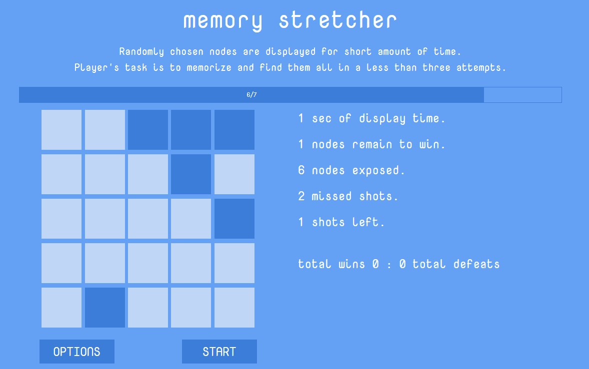

# Memory Stretcher
>Simple game to excercise memory. Randomly chosen nodes are displayed for short amount of time. Player's task is to memorized them and find them all in less than three attempts.

## Table of contents
* [General info](#general-info)
* [Live version](#live-version)
* [Screenshots](#screenshots)
* [Technologies](#technologies)
* [Setup](#setup)
* [Features](#features)
* [Status](#status)

## General info
Project made for fun. Main purpose is to learn testing with JEST and React Testing Library, on examples of components and functions from this project.

## Live version
You can test your memory here: https://sylwiasuwalska.github.io/memory-stretcher/

## Screenshots


## Technologies
* ReactJS 16.13.1
* React Bootstrap

## Setup
To run this project, install it locally using npm:

```
# Clone this repository
$ git clone git@github.com:sylwiasuwalska/memory-stretcher.git

# Go into the repository directory

# Install dependencies
$ npm install

# Run the app
$ npm start
```

## Features
In this project player sees
* Simple stats of current game
* Scores of wins and defeats from all games

To-do list:
* Improving adding classes on user's click
* Blocking "start game" button to prevent unwanted user's actions
* Tests

## Status
Project is in progress.
